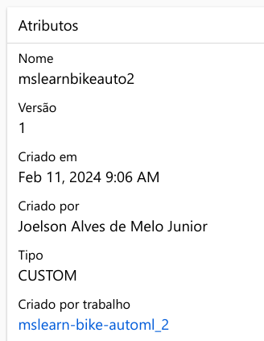
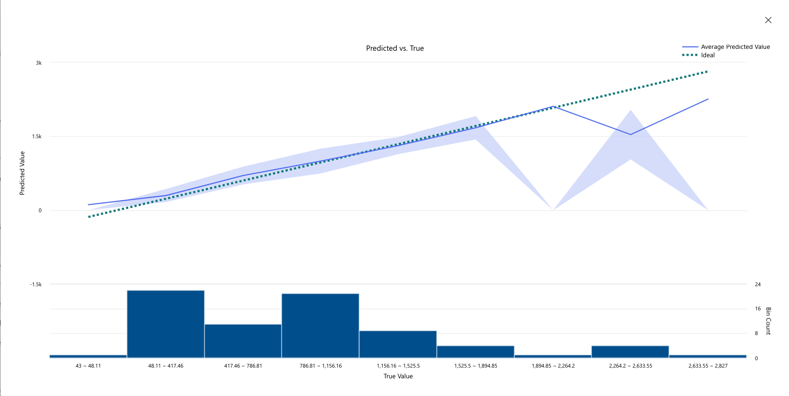
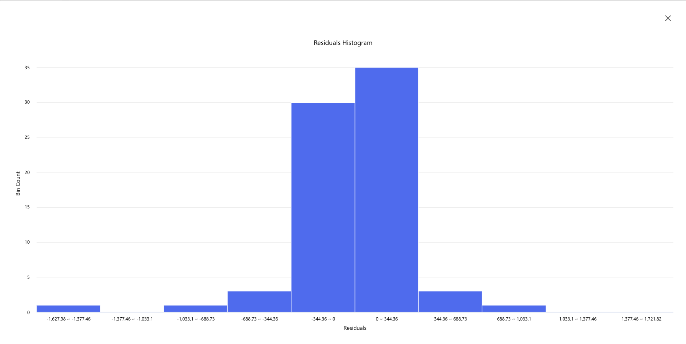
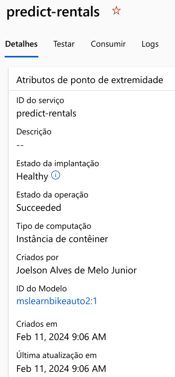

# Bootcamp Microsoft Azure AI Fundamentals

# Trabalhando com Machine Learning na Prática no Azure ML

## 1. Passo a passo 

https://microsoftlearning.github.io/mslearn-ai-fundamentals/Instructions/Labs/01-machine-learning.html

## 2. Modelo de previsão



## 3. Métricas do modelo

### 3.1. Predict vs True


### 3.2. Residuals


## 4. Ponto de extremidade



## 5. Realização de testes

### 5.1. Entrada
```
{
  "Inputs": { 
    "data": [
      {
        "day": 1,
        "mnth": 1,   
        "year": 2022,
        "season": 2,
        "holiday": 0,
        "weekday": 1,
        "workingday": 1,
        "weathersit": 2, 
        "temp": 0.3, 
        "atemp": 0.3,
        "hum": 0.3,
        "windspeed": 0.3 
      }
    ]    
  },   
  "GlobalParameters": 1.0
}
```

### 5.2. Saída
```
{
  "Results": [
    351.3297544158021
  ]
}
```
